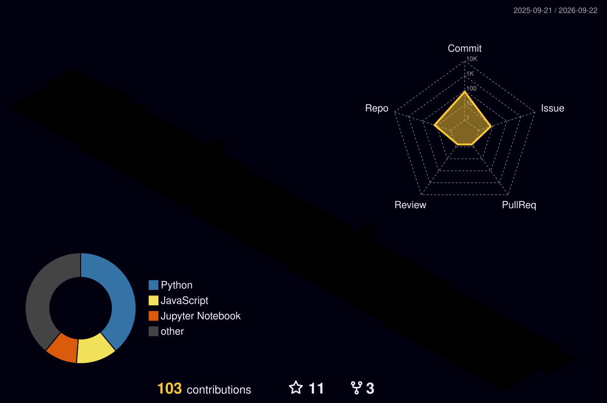

  

<h1 align="center">Kiki</h1>

  

  
  
  

  
  
  
  

  

## Project Setlist

<table>
  <tr>
    <td width="33%" valign="top">
      
       
      <b>01 · RL Car Racing</b>
       
      Reinforcement learning course project in a car-racing environment.
    </td>
    <td width="33%" valign="top">
      
       
      <b>02 · Persona</b>
       
      A project exploring persona-based AI interaction.
    </td>
    <td width="33%" valign="top">
      
       
      <b>03 · Godot Balatro + LLM Cards</b>
       
      Roughly recreated Balatro in Godot, and experimented with adding LLM-based cards.
    </td>
  </tr>
</table>

  
  
  

## GitHub Activity

  

  

  

  

