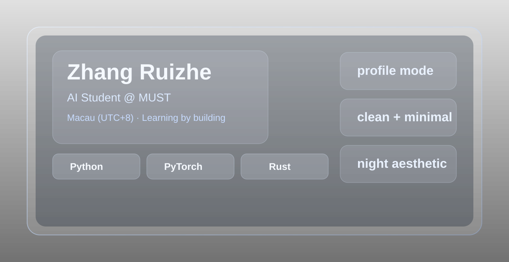

  

## About

I am an undergraduate AI student at Macau University of Science and Technology.

I enjoy learning through small projects and experiments in machine learning, simulation, and practical system building.

## Stack

`Python` · `PyTorch` · `C` · `C++` · `Rust` · `Vue` · `GDScript`

## Charts

  
  

  

## Projects

[RL Car Racing](https://github.com/onp-china/RL_class_Project-Car_racing)  
Reinforcement learning course project in a car racing environment.

[Persona](https://github.com/onp-china/Persona)  
A small project exploring persona-based AI interaction.

[Robotics Course Project](https://github.com/BSAI301/course-project-ex1-team-2)  
Team course project related to robotics simulation and control.
