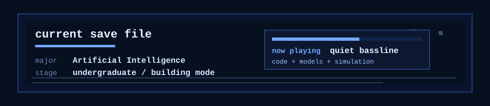
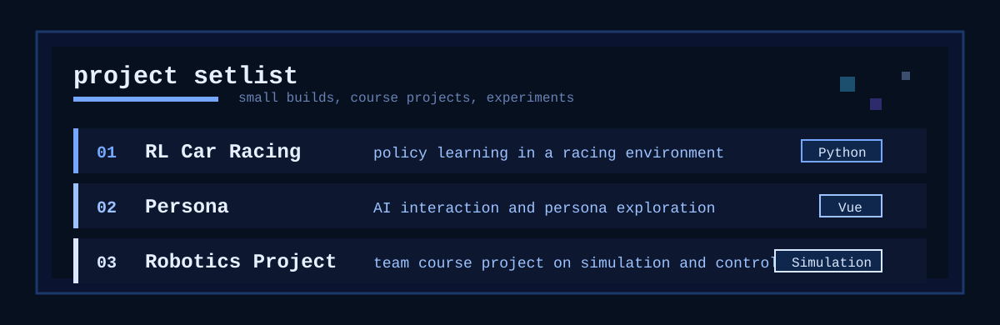

  

  
  
  

<code>AI student at MUST · learning through small experiments · code + models + simulation</code>

---

  

---

## Inventory

  

---

## Projects

  

  <a href="https://github.com/onp-china/RL_class_Project-Car_racing">
    RL Car Racing
  </a>
  ·
  <a href="https://github.com/onp-china/Persona">
    Persona
  </a>
  ·
  <a href="https://github.com/BSAI301/course-project-ex1-team-2">
    Robotics Project
  </a>

